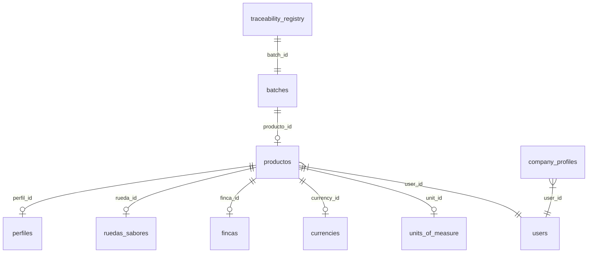

# Modelo de Datos: Marketplace de Especialidad Interactivo

**Fecha**: 2026-04-24  
**Especificación**: [spec.md](./spec.md)

---

## Resumen

El marketplace se construye sobre el esquema de base de datos existente **sin requerir nuevas tablas ni migraciones**. Todas las entidades necesarias ya están implementadas. Este documento describe cómo se mapean las entidades de la especificación a las tablas actuales.

---

## Entidades Existentes

### 1. Producto (`productos`)

| Campo | Tipo | Descripción |
|-------|------|-------------|
| `id` | TEXT (UUID) | Identificador único del producto |
| `user_id` | INTEGER | FK al usuario dueño |
| `nombre` | TEXT | Nombre del producto/lote |
| `descripcion` | TEXT | Descripción comercial |
| `tipo_producto` | TEXT | `'cafe'`, `'cacao'`, `'miel'`, `'otro'` |
| `atributos_dinamicos` | JSON | Atributos variables: `{variedad, proceso, nivel_tueste, puntaje_sca, grupo_genetico, porcentaje_cacao}` |
| `imagenes_json` | JSONB | Array de URLs de imágenes |
| `premios_json` | JSONB | Array de premios `[{nombre, anio, logo_url}]` |
| `perfil_id` | INTEGER | FK a tabla `perfiles` (perfil de taza) |
| `rueda_id` | INTEGER | FK a tabla `ruedas_sabores` (notas de sabor) |
| `finca_id` | TEXT | FK a tabla `fincas` (origen) |
| `precio` | NUMERIC | Precio unitario |
| `currency_id` | INTEGER | FK a moneda |
| `unit_id` | INTEGER | FK a unidad de medida |
| `is_published` | BOOLEAN | Visibilidad pública |
| `deleted_at` | TIMESTAMPTZ | Soft delete |

**Validaciones**:
- `tipo_producto` restringido a `CHECK('cafe', 'cacao', 'miel', 'otro')`
- `is_published = TRUE` y `deleted_at IS NULL` para aparecer en el marketplace

---

### 2. Perfil Sensorial (`perfiles`)

| Campo | Tipo | Descripción |
|-------|------|-------------|
| `id` | SERIAL | PK |
| `user_id` | INTEGER | FK al usuario |
| `nombre` | TEXT | Nombre del perfil |
| `tipo` | TEXT | `'cafe'` o `'cacao'` |
| `perfil_data` | JSONB | Datos cuantitativos del perfil |

**Estructura de `perfil_data`** (café):
```json
{
  "fraganciaAroma": 7.5,
  "sabor": 8.0,
  "postgusto": 7.0,
  "acidez": 7.5,
  "cuerpo": 7.0,
  "dulzura": 8.0,
  "balance": 7.5,
  "limpieza": 8.0,
  "impresionGeneral": 7.5
}
```

**Estructura de `perfil_data`** (cacao):
```json
{
  "cacao": 8.0,
  "acidez": 6.5,
  "amargor": 5.0,
  "astringencia": 3.0,
  "frutaFresca": 7.0,
  "frutaMarron": 5.5,
  "vegetal": 2.0,
  "floral": 6.0,
  "madera": 3.5,
  "especia": 4.0,
  "nuez": 5.0,
  "caramelo": 6.5
}
```

---

### 3. Rueda de Sabores del Producto (`ruedas_sabores`)

| Campo | Tipo | Descripción |
|-------|------|-------------|
| `id` | SERIAL | PK |
| `user_id` | INTEGER | FK al usuario |
| `nombre_rueda` | TEXT | Nombre descriptivo |
| `tipo` | TEXT | `'cafe'` o `'cacao'` |
| `notas_json` | JSONB | Array de notas seleccionadas |

**Estructura de `notas_json`**:
```json
[
  { "category": "Frutal", "subnote": "Cereza" },
  { "category": "Floral", "subnote": "Jazmín" },
  { "category": "Dulce", "subnote": "Miel" }
]
```

---

### 4. Finca / Origen (`fincas`)

| Campo | Tipo | Descripción |
|-------|------|-------------|
| `id` | TEXT (UUID) | PK |
| `nombre_finca` | TEXT | Nombre de la finca |
| `pais`, `departamento`, `provincia`, `distrito` | TEXT | Ubicación geográfica |
| `altura` | INTEGER | Metros sobre el nivel del mar |
| `propietario` | TEXT | Nombre del productor |
| `coordenadas` | JSONB | GeoJSON o `{lat, lng}` |
| `historia` | TEXT | Historia de la finca |
| `imagenes_json` | JSONB | Fotos de la finca |
| `premios_json` | JSONB | Premios de la finca |

---

### 5. Registro de Trazabilidad (`traceability_registry` + `batches`)

| Campo | Tipo | Descripción |
|-------|------|-------------|
| `batch_id` | TEXT | FK al lote |
| `blockchain_hash` | TEXT | Hash de verificación en blockchain |
| `snapshot_data` | JSONB | Historial completo pre-calculado |

**Relación con Productos**: Un producto tiene trazabilidad verificada cuando existe al menos un registro en `traceability_registry` vinculado a un `batch` que referencia a ese `producto_id`.

---

### 6. Estándar de Rueda de Sabores (Archivo Estático)

| Ubicación | Formato | Descripción |
|-----------|---------|-------------|
| `public/data/flavor-wheels.json` | JSON | Jerarquía completa SCA + CoE + Miel |

**Estructura jerárquica**:
```
{tipo} → {categoría} → {subcategoría?} → {nota}
```

- **Café (SCA)**: 9 categorías raíz, ~100 notas hoja
- **Cacao (CoE)**: 8 categorías raíz, ~25 notas hoja
- **Miel**: 8 categorías raíz, ~35 notas hoja

---

## Diagrama de Relaciones



---

## Cambios Requeridos en el Esquema

**Ninguno.** El esquema actual soporta todas las funcionalidades especificadas.

Los cambios necesarios son exclusivamente a nivel de:
1. **Frontend** (`marketplace.html`, `marketplace.js`): Nuevos filtros, búsqueda textual, mejoras UX.
2. **Datos estáticos**: El archivo `flavor-wheels.json` ya contiene los estándares SCA y CoE.
3. **Backend (opcional)**: Agregar búsqueda textual al endpoint si se escala más allá de 500 productos.
